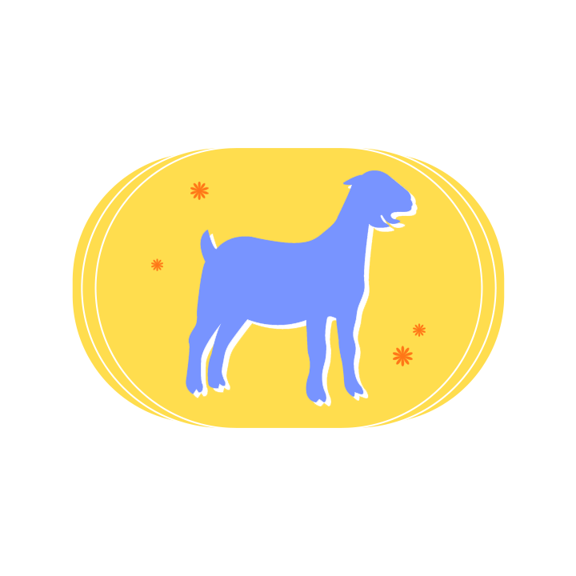

<h1>THE *MONTY HALL* PROBLEM</h1>

<h2>The Problem</h2>

The Monty Hall problem starts with 3 doors. Behind 1 of these doors is a
car, and the other 2 are goats. You pick 1 door of your choice, and then
"Monty" picks one of the unopened doors which is guaranteed to be a
goat. This means that between your door and the other door, one is the
car and the other is the goat. The question is, do you change your door
of choice to the other door or stick to your initial choice?    
Interestingly enough, while it may seem like a 50/50 probability, it was
found that changing your door to the other one has a 2/3 probability of
winning. Why is this the case?

<section class="doors">

 

 

</section> 

Initially, let's assume that there is no bias or influence that's
helping us determine which door is likely to be the car or a goat at the
start. This means that each door equally has a 1/3 probability of being
picked. If our first choice is a goat, then switching would result in
the car. On the other hand, if your first choice is the car, then
switching would surely result in a goat. While the odds may seem equal,
take note that we have 2 options for the goat behind the door. This
means that, given we switch doors at the end, we now have 2 doors that
will lead to victory, or essentially a 2/3 chance of winning like
mentioned a while ago.     

To further understand why switching works, suppose there are 100 doors to choose from and Monty opens 98 with goats, leaving two for you to pick from. When you picked your first door, you had 1/100 chance of getting the jackpot prize. However, Monty now presents you with a filtered choice and, thus, giving you a higher chance of winning the car. This is why the better option is to switch instead of staying with your first pick.

<h1>PCSO *ULTRA LOTTO 6/58*</h1>

<h2>The Problem</h2>

<!--PCSO Lotto Section-->

The PCSO Lottery Draw is the Philippine Charity Sweepstakes Office's television game show which aired daily on the People's Television Network since March 8, 1995. The UltraLotto 6/58 is a lottery game wherein the player buys a card for 20 pesos, and picks out 6 numbers ranging from 1-58, wherein a number can only be picked once. The current prizepool is 50 Million Pesos, leading some to believe that buying many cards would give them better chances.  This is hardly true as the possibility of getting all 6 numbers correct is so small, specifically 1/40,475,358 such that even buying a few more cards would only add mere fractions of a percentage to that possibility.

Like other PCSO lottery games, UltraLotto 6/58 requires a bettor to choose six (6) winning unique numbers ranging from 1 to 58. To bag the jackpot prize, one’s chosen 6 numbers must match the numbers officially drawn by the PCSO during the lottery draw date. Should there be two or more winners, the jackpot price will be equally divided among them (PCSO).  Since the order of the drawn numbers does not matter, the odds of winning such a lottery game can be determined using the combination formula.

Where *n* is the total number of items in a given set and *r* is the number of chosen items from the set. 

To determine the number of possible winning combinations we will let n = 58 and r = 6.  

Assuming that each ticket costs 20 PHP, you will need 809, 507, 160 PHP to cover all the game expenses. In line with this, the 50M jackpot price is just about 6.17% of the total expense, so betting on all combinations is definitely not worth it.

If we were to calculate how many cards it would take to get all possible combinations of numbers, we would need to purchase 40,475,358 cards, costing us 809,507,160 pesos, which is immensely greater than the 50 million peso prize, thus incurring a massive loss on the bettor.

<footer>
<h2>References</h2>
Glen, Stephanie. “Monty Hall Problem: Solution Explained Simply.” Statistics How To, 13 June 2021,   https://www.statisticshowto.com/probability-and-statistics/monty-hall-problem/.
 
 
Lucas, Stephen, et al. “The Monty Hall Problem, Reconsidered.” Mathematics Magazine, vol. 82, no. 5, 2009, pp.  332–342., https://doi.org/10.4169/002557009x478355. Accessed 29 June 2022. 
 
 
Stone, Rebecca. “Simple Proof of Solution to the Monty Hall Problem.” Rebecca Stone Blog, 31 Oct. 2017,  https://ysbecca.github.io/random/2017/10/31/monty-hall.html. 
 
“UltraLotto 6/58.” Philippine Charity Sweepstakes Office, https://www.pcso.gov.ph/Games/Lotto/UltraLotto658.aspx.
 
 
Weisstein, Eric W. “Monty Hall Problem.” Wolfram MathWorld, https://mathworld.wolfram.com/MontyHallProblem.html. 
</footer>

